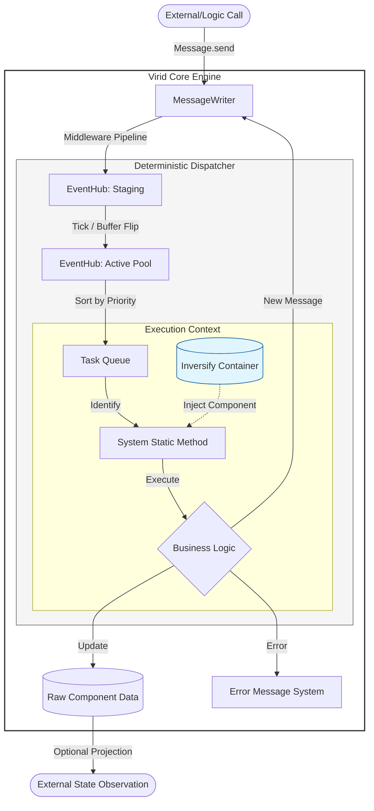

# 🛰️ @virid/core


> **A Lightweight, Message-Driven Logic Engine inspired by Rust's ECS Architecture and Nestjs.**

[中文说明](README.zh.md)

## ✨ Features


### 🧩 What is CCS Architecture?

`virid` is built on the **CCS (Component-Controller-System)** architecture. Based on the traditional ECS (Entity-Component-System) pattern, it introduces a "Controller" layer specifically for Web/UI environments to bridge logic and views seamlessly.

#### 1. 💾 Component (Data) — "The Container of Truth"

- **Definition**: Pure data structures containing zero business logic.
- **Responsibility**: Stores state (e.g., `PlaylistComponent` storing song lists and playback status). In `virid`, Components are managed as **Singletons** within the IoC container.

#### 2. 🎮 Controller (The Bridge) — "The Anchor of Views"

- **Definition**: A proxy layer between the UI framework (Vue) and the core logic (Core).
- **Responsibility**:
  - **Projection**: Safely maps data from `Components` to Vue using `@Project`.
  - **Command**: Captures UI events (like clicks) and transforms them into `Messages` to be dispatched to the engine.
  - **Context Awareness**: Perceives UI hierarchy and metadata (like list indices) via `@Env`.

#### 3. ⚙️ System (Logic) — "The Arbiter of Causality"

- **Definition**: A collection of stateless static methods and the **only** legitimate place for state transitions.
- **Responsibility**: Listens for `Messages` and modifies `Component` data accordingly. Systems are **deterministic**, ensuring that the same input always yields the same state transition.

### 🛠️ Decoupling of Logic Sovereignty

### 1. Total UI Demotion: Framework-Agnostic Core

- **Transfer of Sovereignty**: The UI framework is stripped of its authority over state management and business scheduling, relegated to a pure **"State Projection Layer."** All business causality and state machine transitions are executed within the closed loop of `virid Core`.
- **Physical Isolation**: The Core layer has zero dependencies on `DOM/BOM` APIs. Your core logic runs seamlessly in **Node.js servers, Web Workers, or even Command Line Interface (CLI) tools**.
- **Seamless Migration**: Logical assets are no longer tethered to a specific UI library. Switch the adapter layer, and you are ready for **Vue, React, or beyond**.

### 2. Production-Grade Testability

- **Farewell to Mocking Hell**: Say goodbye to JSDOM and complex browser simulations. Since the core logic is pure JS/TS, you can boot the Core directly in Node.js and complete unit tests for complex business flows via a **"Send Message -> Assert State"** pattern.
- **Logic Playback**: As all side effects are triggered by messages, business logic becomes a **pure pipeline**, enabling offline refactoring and automated regression of production logic paths.

### 3. Powerful Inversion of Control (IoC)

- **Deep IoC Architecture**: Built on **InversifyJS** for robust Dependency Injection. `Systems`, `Components`, and `Controllers` are auto-assembled via the container.
- **Dynamic Lifecycle**: Supports on-demand loading and auto-injection of logic modules. Whether it’s a global singleton `System` or a `Controller` that dies with a component, the container manages the entire lifecycle.

---

## 🏎️ Game-Grade Scheduling Engine

- **Deterministic Tick Mechanism**: Introduces a Bevy-inspired message loop where all logical changes advance within discrete "Ticks."
- **Double-Buffered Message Pool**: Physically isolates "processing" and "incoming" messages, effectively eliminating infinite loops and logical jitter.
- **Physically Isolated Message Strategies**:
  - **SingleMessage (Signal)**: Automatically merges identical signals, triggering a single batch process within the same Tick.
  - **EventMessage (Event)**: Guarantees strict sequential execution, ensuring the atomicity of logical chains.

---

## 🛡️ State Security & Access Control

- **Read-Only Data Shield**: Controllers receive read-only proxies by default, strictly prohibiting illegal tampering with `Component` states outside of a `System`.
- **Atomic Modification Protocol**: Data changes are forced through specific `AtomicModifyMessage` protocols, ensuring every state transition is traceable and auditable.

---

## 🧬 Declarative Meta-Programming

- **Decorator-Driven**: Use `@System`, `@Message`, `@Inherit`, and `@Project` to declaratively describe complex dependency networks and reactive logic flows.
- **Automated Data Routing**: Dispatching a message immediately triggers the response; parameters are injected automatically, eliminating the need to write tedious boilerplate for listeners and dispatchers.

## 📖 Quick Start

⚠️ Important: You MUST import reflect-metadata at the very first line of your entry file (e.g., main.ts), otherwise decorators will not function correctly.

Build a strictly protected state machine in a pure JS environment in just three steps.

### 1. Define Components & Messages

**Components** are pure data structures; **Messages** are the sole driving contracts.

```ts
import {
  createvirid,
  Component,
  System,
  Message,
  SingleMessage,
  AtomicModifyMessage,
} from "@virid/core";

// Initialize the core engine
const app = createVirid();

// Define Data Entity (Component)
@Component()
class CounterComponent {
  public count = 0;
}
// Register component
app.bindComponent(CounterComponent);

// Define operation instructions (Message)
class IncrementMessage extends SingleMessage {
  constructor(public amount: number) {
    super();
  }
}
```

### 2. Implement Systems

**Systems** are stateless static methods. They retrieve components via Dependency Injection (DI) to handle business logic. You don't need to manually instantiate or invoke them—virid will automatically discover and execute them through static analysis.

```ts
//Define System
class CounterSystem {
  @System()
  static onIncrement(
    @Message(IncrementMessage) message: IncrementMessage,
    count: CounterComponent,
  ) {
    console.log("---------------------System----------------------");
    console.log("message :>> ", message);
    count.count += message.amount;
  }
}
```

### 3. Headless Execution

No browser required. Drive your business logic directly in **Node.js** or any testing framework.

```ts
// Business logic automatically completes scheduling in the next microtask
queueMicrotask(() => {
  IncrementMessage.send(1);
  IncrementMessage.send(5);
  queueMicrotask(() => {
    AtomicModifyMessage.send(
      CounterComponent,
      (comp) => {
        console.log("----------------AtomicModifyMessage------------------");
        console.log("CounterComponent :>> ", comp);
      },
      "Check CounterComponent",
    );
  });
});
```

## 🛠️ Advanced Engineering Practices

### ⚓ Lifecycle Interception (Middleware & AOP Hooks)

virid provides deep access to the message pipeline, allowing you to easily extend the system with features like **Undo/Redo, State Synchronization, or Automated Logging**.

- **Middleware**: Pre-process messages before they enter the `EventHub`.

  TypeScript

  ```
  app.useMiddleware((message, next) => {
    console.log(`[Log]: Intercepted message ${message.constructor.name}`);
    next(); // Continue the pipeline
  });
  ```

- **AOP Hooks**: Perform aspect-oriented processing before or after specific message execution.
  - `onBeforeExecute`: Triggered before System logic runs (e.g., for permission checks).
  - `onAfterExecute`: Triggered after logic execution (e.g., for data persistence).

  TypeScript

  ```
  app.onBeforeExecute(IncrementMessage, (message, context) => {
    console.log("---------------- onBeforeExecute ------------------");
    console.log("Message Details:", message);
    console.log("Target System:", context.targetClass.name);
    console.log("Method Context:", context.methodName);
  });
  ```

---

### ⚡ Atomic Modification: The "Snapshot" Privilege

To balance **strict constraints** with **development efficiency**, virid allows direct state mutations via `AtomicModifyMessage` without the need to write a full `System`.

- **Semantic Mutations**: Every atomic modification requires a mandatory `label`, transforming "arbitrary" assignments into auditable, meaningful actions.
- **Consistency Guarantee**: Atomic modifications still follow the **Tick Scheduling** mechanism, ensuring that data changes are synchronized with System logic.

---

### 🚨 Everything is a Message: Robust Error Monitoring

virid treats exceptions as first-class citizens of the system:

- **Automatic Encapsulation**: Any synchronous or asynchronous exception within a `System` or `Hook` is automatically captured by the `Dispatcher` and encapsulated into an `ErrorMessage`.
- **Defensive Programming**: You can define a dedicated `ErrorSystem` to handle these messages globally (e.g., reporting to Sentry or triggering UI alerts). This ensures the core engine remains resilient and never crashes due to a single component failure.

---

---

## 🚀 Conclusion: Why virid?

virid is not just another state management library; it is an endeavor to introduce **Deterministic Industrial Standards** to Web development.

As your project scales from dozens to thousands of components, and your business logic evolves from simple CRUD into intricate cross-component choreographies, the virid architecture ensures that your codebase remains:

- **Traceable**: Every logical transition has a clear trail via messages.
- **Predictable**: Every state modification follows strict, predefined protocols.
- **Decoupled**: Every business flow can be tested and validated entirely independent of the UI.

### 🛰️ Data Flow Architecture


