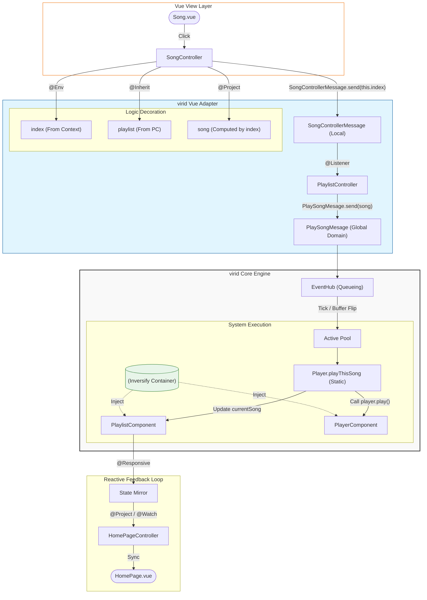

# 🛰️ @virid/vue

[中文说明](file://.README.zh.md)

**The Bridge between virid Core and Vue.**

**_Turning Vue into the most elegant "State Projectionist" for the virid Engine._**

---

## 🧩 Positioning: Governing View Projections

`@virid/vue` is by no means just another state management plugin. On the contrary, in the virid worldview: **Vue itself is a plugin for virid.**

#### **Core Philosophy: Architectural Sovereignty**

The traditional paradigm is "Writing business logic inside Vue"; in virid, **business logic is immortal within the Core**, while Vue is merely a transient projection of that logic onto the browser DOM.

- **Logic Sovereignty**: All causality (**Messages**), rule sets (**Systems**), and data sources (**Components**) operate independently of Vue.
- **View Terminal**: Vue surrenders its authority to mutate state. It is demoted to an intelligent terminal, responsible only for rendering projections and triggering instructions.

---

### 🛡️ How it Empowers the Core

If the Core is the brain, `@virid/vue` provides the neurons. It grants the Core the privilege to bridge the chasm between "Logic" and "View":

#### **1. Data Manifestation: Reactive Projection**

Components within the Core are pure data structures, incapable of driving a UI on their own.

- **Enhancement**: Using `@Project` and `@Responsive`, the adapter transforms static Core data into Vue-compatible reactive Proxies via the **Deep Shield**.
- **Behavior**: When data shifts within the Core, the UI senses it instantly. However, if the UI attempts to mutate the projection directly, the Shield intercepts the violation immediately.

#### **2. Perceptual Synergy: Dependency Tethering**

The Core is singleton and flat; the UI is tree-like and volatile.

- **Enhancement**: By introducing `useController` and `@Inherit`, the adapter allows the Core to "perceive" UI hierarchy. Through the **Global Registry**, logic is no longer rigid—it dynamically establishes "logic tunnels" based on UI mounting states.
- **Behavior**: Child components maintain weak references to parent logic via `@Inherit`. The flow of logic strictly adheres to the topological structure defined by the Core.

#### **3. Causal Closed-Loop: Immediate UI Arbitration**

Vue’s native lifecycles and events can often become chaotic.

- **Enhancement**: The adapter introduces `@Listener` and `@OnHook`. It ensures UI actions (e.g., clicks, mounting) no longer execute business logic directly but are instead converted into a **ControllerMessage**.
- **Behavior**: Every UI behavior is standardized as a "Message." The Core acts as an arbiter, judging these messages through **Systems**. This guarantees that even in a Vue environment, every line of logic must pass through the virid Dispatcher's priority queue.

## 🚀 Quick Start: virid in Action

In this example, we will implement a classic scenario: **Click a song from a list, send a command through the Controller, and let the System determine the playback logic.**

### 1. Define Data (Component)

First, define your data structure in the Core. No need to worry about Vue here.

```typescript
// PlayerComponent.ts
import { Component } from "@virid/core";
import { Responsive } from "@virid/vue";

@Component()
export class PlaylistComponent {
  @Responsive() // Make Core data perceptible to Vue
  public currentSongName: string = "Not Playing";
}
```

### 2. Define Instructions (Message)

Define what the user intends to do.

```typescript
// logic/messages.ts
import { SingleMessage } from "@virid/core";

export class PlaySongMessage extends SingleMessage {
  constructor(public songName: string) {
    super();
  }
}
```

### 3. Define Rules (System)

Write business logic in the Core. It acts as the absolute arbiter.

```typescript
// PlayerSystem.ts
import { System, Message } from "@virid/core";
import { PlaySongMessage } from "../messages";
import { PlaylistComponent } from "../components/PlayerComponent";

export class PlayerSystem {
  @System()
  static onPlay(
    @Message(PlaySongMessage) msg: PlaySongMessage,
    state: PlaylistComponent,
  ) {
    // All logic loops are closed here: Mutate data
    state.currentSongName = msg.songName;
    console.log(`Core is now playing: ${msg.songName}`);
  }
}
```

### 4. Bridge the View (Controller & Vue)

This is where `@virid/vue` performs its magic, "projecting" logic onto Vue.

**Controller (Logic Adapter):**

```typescript
// logic/controllers/SongController.ts
import { Controller } from "@virid/core";
import { Project, Responsive } from "@virid/vue";
import { PlaylistComponent } from "../components/PlayerComponent";
import { PlaySongMessage } from "../messages";

@Controller()
export class SongController {
  @Project(PlaylistComponent, (c) => c.currentSongName)
  public playing!: string; // Projection: Read-only mirror of Core data

  // Define local UI state
  @Responsive()
  public list = ["think of you", "ROCK IN!", "Instant Love"];

  play(name: string) {
    PlaySongMessage.send(name); // Send instruction instead of mutating data directly
  }
}
```

**Vue Component:**

```vue
<template>
  <div>
    <h3>Now Playing: {{ ctrl.playing }}</h3>
    <ul>
      <li v-for="s in ctrl.list" :key="s" @click="ctrl.play(s)">
        Play: {{ s }}
      </li>
    </ul>
  </div>
</template>

<script setup lang="ts">
  import { useController } from "@virid/vue";
  import { SongController } from "./logic/controllers/SongController";

  // All the magic happens here: bind the Controller to the Vue lifecycle
  const ctrl = useController(SongController);
</script>
```

## 📘 virid Core Concepts: The "Layman's Legend" Edition

### 1. `@Project` —— The One-Way Lens (The Projector)

- **Plain English**: Imagine installing a one-way peephole on the window of the Core's engine room from the UI side.
- **What it does**: The `playing` property in a Controller doesn't store data; it’s a **real-time shadow** of `currentSongName` inside the `PlaylistComponent`.
- **The Law**: Since it’s a projection, you cannot change the entity by modifying the shadow. If you try `this.playing = "New Song"`, the framework will shout: "Read-only! Want a change? Submit a **Message**."

### 2. `@Responsive` —— The Reactive Neuron

- **Plain English**: Giving a standard TypeScript class a shot of "Vue Adrenaline."
- **What it does**: Core classes are usually cold, static data structures. With this, when a **System** modifies a value deep in the Core, the change flows through the `@Project` pipeline and **instantly lights up** every Vue component referencing it.
- **The Law**: It is the "sole base station" for the UI to perceive logical shifts.

### 3. `useController` —— The Logical Anchor (The Tether)

- **Plain English**: Dropping an anchor into the Vue ocean to tether a "Logic Beast" from the virid Core.
- **What it does**: The Vue component says, "I only care about styling, not business logic." It hires a representative (the Controller) through `useController`. This proxy is retrieved from the **IoC Container**, appearing when the component mounts and vanishing when it unmounts.
- **The Law**: This is the **only official gateway** between the Vue world and the virid Core world.

### 4. `Message.send` —— Activating Causality (The Formal Petition)

- **Plain English**: The UI layer completely surrenders its "executive power" and can only send a formal courier to request work from the Core.
- **What it does**: Forget `count++` in Vue. Now you can only submit a petition: "I suggest incrementing the count by 1."
- **Why?**: Because the **System (The Arbiter)** will intercept this message to check rules: Do you have permission? Is this song in the database? Only when the Arbiter nods does the data change and the UI react.

### 5. `@Inherit` —— Logical Parasitism (The Wireless Receiver)

- **Plain English**: It allows child components to "parasitize" and absorb nutrients (data) from parent components or other Controllers from a distance.
- **What it does**: `SongController` doesn't need props to get the playlist. Use `@Inherit(PlaylistController, 'playlist')`, and it automatically locates the parent in the **Global Registry** and builds a private data tunnel.
- **The Law**: This tunnel is a "Weak Reference" with a "Shield." You can look at the parent's data, but you can't touch (mutate) it.

### 6. `@Env` —— The Identity Tag (The Birth Certificate)

- **Plain English**: A small note tucked into a component's pocket at birth (from the Vue side) saying, "This is who you are."
- **What it does**: Pass `:index="index"` in a Vue template and receive it via `@Env() public index!: number` in the Controller. It helps logic instances know their physical position in the UI hierarchy (e.g., "I am the 5th item in the list").
- **The Law**: It’s a metadata marker. It reminds you: "This is air-dropped from the external Vue environment—don't try to change it here."

### 7. `@Listener` —— Intent Radar (The Relay Station)

- **Plain English**: A parent component installs a monitor at home, specifically listening for "local signals" emitted by its children.
- **What it does**: When a child emits a `SongControllerMessage`, the parent's `@Listener` catches it instantly. It translates these fragmented UI actions into **Global Domain Messages** that the entire Core engine can understand.
- **The Law**: It only handles "Translation" and "Forwarding." The final judgment remains the sovereignty of the **System**.

### 8. `@Watch` —— The Action Scout

- **Plain English**: Staring at a specific piece of data and immediately executing a pre-planned "side effect" the moment it changes.
- **What it does**: When the song changes, you might need to trigger a Vue Router jump or a browser notification. Tasks that aren't core business logic but belong to "UI behavior" go here.
- **The Law**: It can scout both Core Components and local Controller states. It’s the trigger for UI ripples after logic shifts.

### 9. `@Use` —— The Toolbelt (The External Plugin)

- **Plain English**: Lawfully borrowing "magic weapons" from the Vue ecosystem (like `useRouter` or `useI18n`) while inside the logic layer.
- **What it does**: Through `@Use(() => useRouter())`, your Controller gains the ability to navigate without having to pass router instances down through ten layers of components.
- **The Law**: It ensures dependencies are **Lazy-Loaded**; the tool is only sought when the Controller is actually activated.

### 10. `@OnHook` —— The Lifecycle Diver

- **Plain English**: Lurking deep in the Vue lifecycle, waiting for the "water level" (mount/unmount) to reach a certain point before jumping out to work.

- **What it does**: Use `@OnHook('onSetup')` to fetch the initial playlist from a server as soon as the Controller is initialized.

- **The Law**: It ensures that while your Controller "lives" in the virid Core philosophy, it dances perfectly to the rhythm of the Vue stage.

---

## ⚡ The Chain of Causality

1. **User Action**: User clicks a `<li>` in the Vue interface.
2. **Controller Relay**: Controller calls `play(name)`, executing `PlaySongMessage.send(name)`.
3. **Core Dispatch**: The Message enters the Core. Since it inherits from `SingleMessage`, the dispatcher queues it automatically.
4. **Arbitration (System)**: `PlayerSystem` wakes up, receives the message packet, and modifies the data in `PlaylistComponent`.
5. **Data Projection**: Because the data is marked `@Responsive` and the Controller is marked `@Project`, the shadow variable `playing` updates automatically.
6. **UI Vibration**: Vue detects the change, re-renders the interface, and the user sees the "Now Playing" status update.

---

## 💡 Why Is This More Elegant?

- **Zero-IQ UI**: Vue components contain no decision-making logic; they simply "click and report."
- **Extreme Data Security**: You cannot execute `state.name = 'xxx'` in a component. Everything must go through a Message, making your logic flow **100% traceable**.
- **Developer Experience**: You still write the Vue templates you love, but you are backed by a rigorous, battle-hardened Core engine.

## Partial data flow chart in the example


