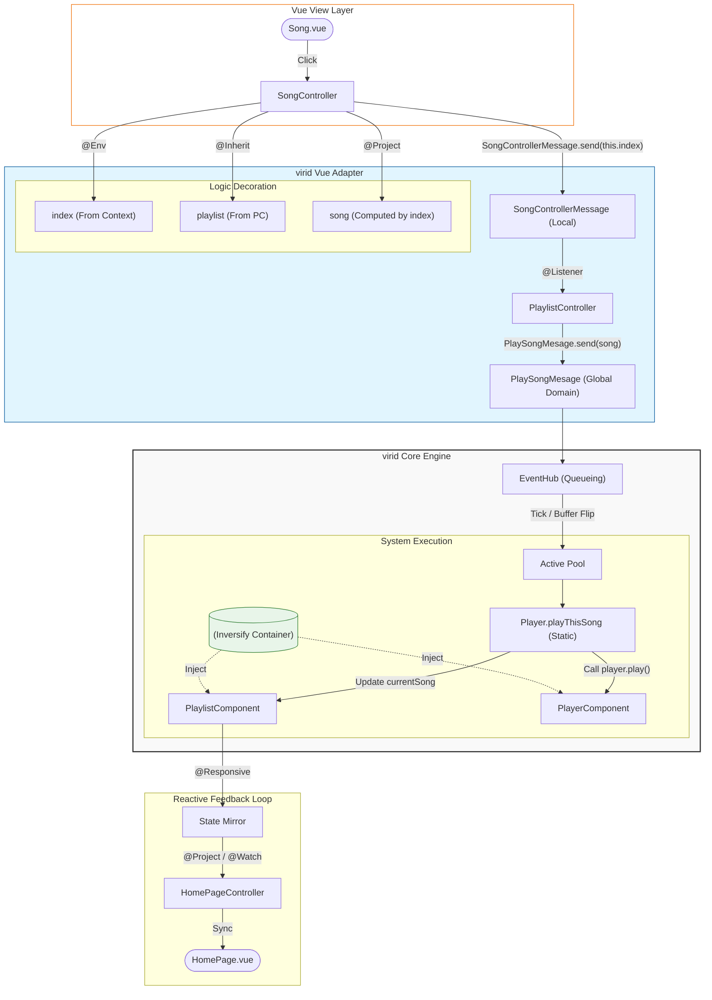

# @virid/vue

> **The Bridge between virid Core and Vue.**
>
> **使 Vue 成为 virid 引擎最华丽的“状态投影仪”。**

## 🧩 定位：统治视图投影

`@virid/vue` 绝非一个普通的 Vue 状态管理插件。相反，在 virid 的世界观里：**Vue 才是 virid 的插件。**

### 核心哲学：架构主权

传统的开发模式是“在 Vue 中写业务”；而在 virid 中，**业务在 Core 中永生**，Vue 仅仅是业务逻辑在浏览器 DOM 上的一层**临时投影**。

- **逻辑主权**：所有的因果律（Message）、规则集（System）和数据源（Component）都独立于 Vue 运行。
- **视图终端**：Vue 失去了对状态的修改权。它被降级为一个智能终端，仅负责接收投影并触发指令。

### 🛡️ 它为 Core 增加了什么能力？

如果说 Core 是大脑，那么 `@virid/vue` 就为大脑接入了神经元。它赋予了 Core 跨越“逻辑与视图”鸿沟的特权：

#### 1. **数据现世化：响应式投影 (Reactive Projection)**

Core 里的 `Component` 只是纯粹的数据结构，本无法驱动 UI。

- **能力增强**：通过 `@Project` 和 `@Responsive`，插件将 Core 内部的静态数据通过 **Deep Shield (深度护盾)** 转化为 Vue 的响应式 Proxy。
- **能力表现**：数据在 Core 中发生偏移，UI 自动感应；但 UI 试图直接修改投影时，护盾会立即拦截。

#### 2. **感知协同：跨层级依赖系留 (Dependency Tethering)**

Core 是单例且扁平的，而 UI 是树状且多变的。

- **能力增强**：插件引入了 `useController` 和 `@Inherit`。它让 Core 具备了“感知 UI 结构”的能力。通过 **Global Registry**，逻辑不再死板，它能根据 UI 的挂载情况动态建立“逻辑隧道”。
- **能力表现**：子组件通过 `@Inherit` 弱引用父级逻辑，逻辑的流动方向严丝合缝地遵循 Core 定义的拓扑结构。

#### 3. **因果闭环：UI 逻辑的即时裁决 (Immediate UI Arbitration)**

Vue 自身的生命周期和事件通常是混乱的。

- **能力增强**：插件引入了 `@Listener` 和 `@OnHook`。它让 UI 的动作（如点击、挂载）不再直接运行业务，而是转化为一条 `ControllerMessage`。
- **能力表现**：一切 UI 行为都被规范化为“消息”。Core 像裁判一样通过 `System` 裁决这些消息。这确保了即便是在 Vue 环境下，每一行逻辑的执行也必须经过 virid 调度中心的优先级排队。

## 🚀 快速上手：virid 实战示例

在这个例子中，我们将实现：**点击列表中的一首歌，通过 Controller 发送指令，最后由 System 决定播放逻辑。**

### 1. 定义数据 (Component)

首先，在 Core 中定义你的数据结构。这里不需要关心 Vue。

```vue
//PlayerComponent.ts import { Component } from '@virid/core' import { Responsive
} from '@virid/vue' @Component() export class PlaylistComponent { @Responsive()
// 让 Core 的数据在 Vue 里可感应 public currentSongName: string = '未播放' }
```

### 2. 定义指令 (Message)

定义用户想做什么。

```
// logic/messages.ts
import { SingleMessage } from '@virid/core'

export class PlaySongMessage extends SingleMessage {
  constructor(public songName: string) { super() }
}
```

### 3. 定义规则 (System)

在 Core 中编写业务逻辑。它是绝对的裁判。

```
// PlayerSystem.ts
import { System, Message } from '@virid/core'
import { PlaySongMessage } from '../messages'
import { PlaylistComponent } from '../components/PlayerComponent'

export class PlayerSystem {
  @System()
  static onPlay(@Message(PlaySongMessage) msg: PlaySongMessage, state: PlaylistComponent) {
    // 所有的逻辑闭环在这里：修改数据
    state.currentSongName = msg.songName
    console.log(`Core 正在播放: ${msg.songName}`)
  }
}
```

### 4. 接入视图 (Controller & Vue)

这是 `@virid/vue` 展现魔力的地方。它把逻辑“投影”给 Vue。

**Controller (逻辑适配器):**

```
// logic/controllers/SongController.ts
import { Controller } from '@virid/core'
import { Project } from '@virid/vue'
import { PlaylistComponent } from '../components/PlayerComponent'
import { PlaySongMessage } from '../messages'

@Controller()
export class SongController {
  @Project(PlaylistComponent, (c) => c.currentSongName)
  public playing!: string // 投影：只读 Core 的数据
  //定义自己的数据
  @Responsive()
  public list = ['think of you', 'ROCK IN!', 'Instant Love']

  play(name: string) {
    PlaySongMessage.send(name) // 发送指令，而不是直接改数据
  }
}
```

**Vue 组件:**

```
<template>
  <div>
    <h3>当前播放：{{ ctrl.playing }}</h3>
    <ul>
      <li v-for="s in ctrl.list" @click="ctrl.play(s)">点击播放：{{ s }}</li>
    </ul>
  </div>
</template>

<script setup lang="ts">
import { useController } from '@virid/vue'
import { SongController } from './logic/controllers/SongController'
//所有的魔法在这里发生
const ctrl = useController(SongController)
</script>
```

---

## 📘 virid 核心概念：通俗演义版

### 1. `@Project` —— 单向透镜（投影仪）

- **白话解释**：它就像是 UI 层在 Core 层卧室窗户上装的一个**单向猫眼**。
- **它在做什么**：Controller 里的 `playing` 属性本身是不存数据的，它只是 `PlaylistComponent` 中 `currentSongName` 的一个**实时影子**。
- **潜规则**：既然是投影，你就**不能通过改影子来改变实体**。如果你在 Controller 里尝试 `this.playing = "新歌"`，框架会警告你：这是只读的！想改？去发 `Message`。

### 2. `@Responsive` —— 响应式神经元

- **白话解释**：给普通的 TypeScript 类打一针“Vue 兴奋剂”。
- **它在做什么**：原本 Core 里的类只是冷冰冰的数据结构。加了它，当 System 在底层修改 `state.currentSongName` 时，这个变化会顺着 `@Project` 的管道，**瞬间点亮**所有正在引用这个数据的 Vue 组件。
- **潜规则**：它是 UI 能感知到逻辑变化的“唯一通信基站”。

### 3. `useController` —— 逻辑锚点（牵引绳）

- **白话解释**：在 Vue 的海洋里，扔下一个锚点，把 Core 里的逻辑怪兽“牵”过来。
- **它在做什么**：Vue 组件说：“我只想管样式，不想管怎么播放。”于是它通过 `useController` 找来了一个代办人（Controller）。这个代办人已经在 IOC 容器里准备好了，组件挂载它就出现，组件销毁它就隐退。
- **潜规则**：它是 Vue 世界与 virid Core 世界的**唯一官方接口**。

### 4. `Message.send` —— 因果律启动（递交申请书）

- **白话解释**：UI 层彻底丧失“执法权”，只能通过**发快递**的方式建议 Core 层干活。
- **它在做什么**：以前你在 Vue 里写 `count++`；现在你只能发送一个“我想让 count 加 1”的申请书。
- **为什么要这么做**：因为 System（裁判）会拦截这个消息，检查你有没有权限播放、这首歌在不在库里。只有裁判（System）点头了，数据才会变，UI 才会跳。

### 5. `@Inherit` —— 逻辑寄生（无线电接收机）

- **白话解释**：它让子组件像“寄生虫”一样，隔空吸取父组件（或其他 Controller）的营养。
- **它在做什么**：你的 `SongController` 不需要手动传 props 拿歌单，只要用 `@Inherit(PlaylistController, 'playlist')`，它就能自动从全局注册表中定位到父组件，并建立一条数据隧道。
- **潜规则**：这条隧道是“弱引用”且带有“护盾”的。即使你拿到了父级的数据，你也只能看，不能碰（只读）。

### 6. `@Env` —— 身份铭牌（出生证明）

- **白话解释**：组件出生时，外面（Vue）塞给它的一张写着“你是谁”的小纸条。
- **它在做什么**：在 Vue 模板里传 `:index="index"`，在 Controller 里用 `@Env() public index!: number` 接收。它解决了逻辑实例如何获知自己在 UI 层级中的物理位置（比如是列表中的第几个）。
- **潜规则**：它只是一个元数据标记，提醒你：这个数据是从外部 Vue 环境“空投”进来的，不要在逻辑层乱改。

### 7. `@Listener` —— 意图雷达（中转站）

- **白话解释**：父组件在家里装了个监控，专门盯着子组件发出的“局部信号”。
- **它在做什么**：当子组件发出了一个 `SongControllerMessage`，父组件的 `@Listener` 会瞬间捕捉到。它负责把这些零碎的小动作，翻译成能惊动整个 Core 引擎的全局大动作。
- **潜规则**：它只负责“翻译”和“转发”，具体的判决依然要交给 `System`。

### 8. `@Watch` —— 动作侦察兵

- **白话解释**：盯着某块数据，一旦它变了，就立刻执行一套预定的“副作用”。
- **它在做什么**：比如歌曲变了，你要调用 Vue Router 跳个转，或者给浏览器弹个通知。这类不属于核心业务逻辑、但属于 UI 表现的需求，交给它。
- **潜规则**：它既能看 Core 里的组件数据，也能看 Controller 里的本地数据。它是逻辑变动后触发 UI 涟漪的开关。

### 9. `@Use` —— 工具包（外挂模组）

- **白话解释**：在逻辑层合法地借用 Vue 生态里的“魔法武器”（如 `useRouter`, `useI18n`）。
- **它在做什么**：通过 `@Use(() => useRouter())`，让你的 Controller 拥有了操作路由的能力，而不需要在 Vue 组件里传来传去。
- **潜规则**：它确保了你的依赖项是延迟加载的，只有在 Controller 真正被激活时才会去寻找这些工具。

### 10. `@OnHook` —— 生命周期潜水员

- **白话解释**：潜伏在 Vue 的生命周期里，等水位到了（比如挂载或销毁）就跳出来干活。
- **它在做什么**：比如 `@OnHook('onSetup')`，让你在 Controller 初始化时去服务器拉取初始歌单。
- **潜规则**：它让你的 Controller 虽然住在 Core 的思想里，但却能精准踩上 Vue 舞台的节拍。

---

## ⚡ 这一套流程的“因果链条”

1. **用户动作**：用户在 Vue 界面点了一下 `<li>`。
2. **Controller 传话**：Controller 调用 `play(name)` 方法，执行 `PlaySongMessage.send(name)`。
3. **核心调度**：`Message` 飞进 Core，由于它继承自 `SingleMessage`，调度器会自动排队。
4. **裁判决策 (System)**：`PlayerSystem` 被唤醒，它拿到消息包，修改了 `PlaylistComponent` 里的数据。
5. **数据投影**：由于数据标记了 `@Responsive`，且 Controller 标记了 `@Project`，影子变量 `playing` 自动更新。
6. **UI 震荡**：Vue 发现数据变了，重新渲染界面，用户看到“当前播放”变了。

---

### 💡 为什么这样写更优雅？

1. **UI 零智商**：Vue 组件里没有任何判断逻辑，它只负责“点一下发个消息”。
2. **数据极度安全**：组件里不能直接执行 `state.name = 'xxx'`，必须通过消息，这让你的逻辑流 100% 可追踪。
3. **开发体验**：你依然在写熟悉的 Vue 模板，但你背后站着一整个严谨的 Core 引擎。

## 🌌 结语：让 UI 回归投影，让逻辑重获自由

在传统的开发模式中，业务逻辑往往沦为 UI 框架的附庸，散落在组件的生命周期与副作用钩子中。**virid** 的诞生，是为了重新划定边界。

核心业务逻辑应该是**纯粹、稳固且可测试的**。它不应被特定的 UI 渲染管线所绑架，而应像星辰般独立运行在自己的轨道上。通过剥离 UI 的主权，virid 赋予了开发者构建跨端、高鲁棒性复杂系统的能力。

## 示例中的部分数据流向图


